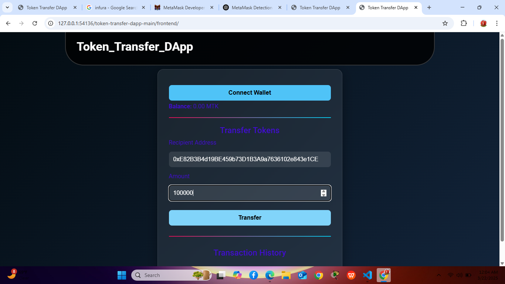
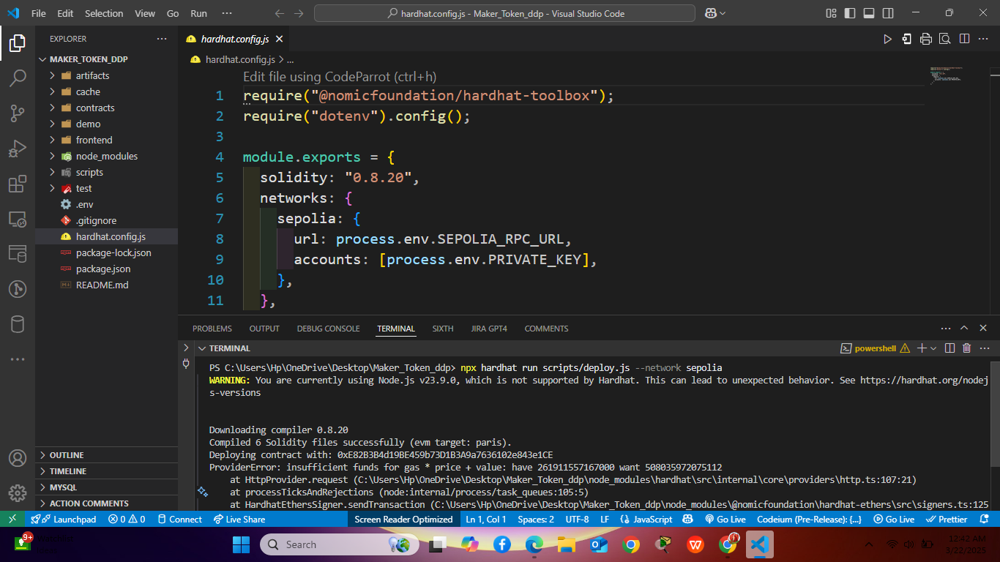
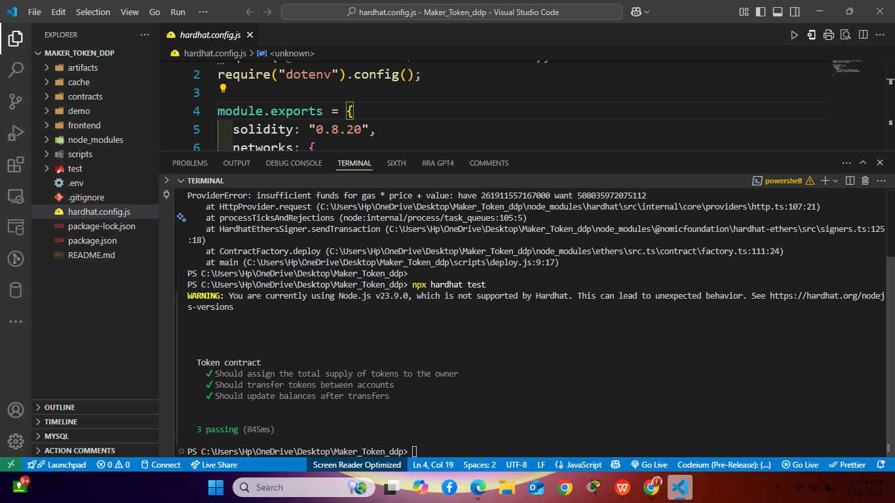

# Token Transfer DApp - ERC-20 on Ethereum Testnet

A simple decentralized application (DApp) that allows users to transfer custom ERC-20 tokens between Ethereum accounts via a web interface.

## 🔧 Features
- ERC-20 Token Smart Contract (Solidity)
- Wallet connection (MetaMask)
- View account token balance
- Transfer tokens to other addresses

## 📸 Screenshots

### 1. DApp Frontend UI  

### 2. Smart Contract Deployment  

### 3. Token Transfer Confirmation  



## 🛠 Tech Stack
- Solidity
- HTML/CSS
- JavaScript
- Web3.js
- MetaMask
- Remix IDE

## 📄 Smart Contract Overview

- Token Name: MyToken
- Symbol: MTK
- Initial Supply: 1,000,000 MTK

### Contract Functions
- `balanceOf(address account)`
- `transfer(address recipient, uint256 amount)`

## 📦 Installation & Usage

1. **Clone the Repository**
   ```bash
   git clone https://github.com/YourUsername/Token-Transfer-DApp.git
   cd Token-Transfer-DApp

### Author: Joshua Malong
github.com/Malongmak
